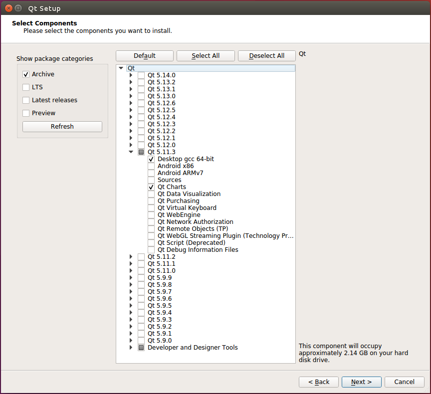

# Using QGC on Ubuntu 16.04

## OS Installation

Because QGC is optimized for Ubuntu 16.04 ( Many components need Ubuntu 16.04 and later, 
in addition Gstreamer 1.0 installation on Ubuntu 18.04 sometimes reveals some problems),
this guide is prepared for Ubuntu 16.04

To install Ubuntu 16.04:
1. Fetch the latest [Ubuntu 16.04 ISO from here](http://releases.ubuntu.com/16.04/)
1. Make a bootable USB stick out of the ISO e.g. by [following this guide](https://tutorials.ubuntu.com/tutorial/tutorial-create-a-usb-stick-on-ubuntu#0).
1. Boot the target device from the stick.

### It is assumed that Ubuntu Software Installation is made

### Update GStreamer

Once Ubuntu 16.04 is installed and booted we need to set up the environment for QGC.
First, we need to update GStreamer to a more recent version.
This part follows QGC's Video Streaming Guide tips found here: https://github.com/mavlink/qgroundcontrol/tree/master/src/VideoStreaming

```
list=$(apt-cache --names-only search ^gstreamer1.0-* | awk '{ print $1 }' | grep -v gstreamer1.0-hybris)
sudo apt-get install $list
sudo apt-get install libgstreamer-plugins-base1.0-dev
```
**Note:** Make sure Gstreamer 1.0 is running (On the receiving end, if you want to test it from the command line, you can use something like:)
```gst-launch-1.0 udpsrc port=5600 caps='application/x-rtp, media=(string)video, clock-rate=(int)90000, encoding-name=(string)H264' ! rtph264depay ! h264parse ! avdec_h264 ! autovideosink fps-update-interval=1000 sync=false
```

### Installing SDL2

SDL2 is used for joystick support.

```
sudo apt-get install speech-dispatcher libudev-dev libsdl2-dev
```

## Running QGC on Ubuntu

Before launching QGC, you need to make sure the current user has access to the dialout group (serial port access permission):
```
sudo usermod -a -G dialout $USER
```

You should also remove modemmanager since it also interferes:
```
sudo apt-get remove modemmanager
```

### Connection problems with multiple networks

In our test with CentOS we had problems when connecting to multiple networks through multiple network devices even with appropriate IP address and subnet assignment.
Probably this issue occurs on Ubuntu, too because this is about network.

Issues consisted of:
- Losing Internet access when connecting to a second network
- Having flaky connection to the vehicle with a lot of hiccups and packet losses (e.g. 30 seconds perfect connection 4 seconds of packet loss in a regular pattern)

If you face any of these problems avoid them by only connecting one network at a time e.g. switching between WiFi and Microhard.

### Executing a Prebuilt QGC Binary

- Get hold of an appimage containing a prebuilt binary of QGC for Ubuntu.
  At the moment there is an automatic deployment for this build.
- [Go to Daily Builds webpage](https://docs.qgroundcontrol.com/en/releases/daily_builds.html) and download the AppImage by clicking Linux link.
- Go inside the `Downloads` folder in `Terminal` and locate the file named `QGroundControl.AppImage`
- Run it by executing the commands
  ```
  chmod +x QGroundControl.AppImage
  ./QGroundControl.AppImage
  ```

## Building QGC on Ubuntu

### Installing Qt
```
mkdir ~/devel
cd ~/devel
```

Install Qt 5.11.3 from the Qt installation script that can be downloaded [here](https://www.qt.io/download-thank-you?os=linux&hsLang=en).
Once downloaded, make it executable and run it:
```
chmod +x qt-unified-linux-x64-3.1.1-online.run
./qt-unified-linux-x64-3.1.1-online.run
```

Select the following options and install it under `~/devel/Qt`:



### Clone and Build QGC

Go inside the `~/devel/` folder.

```
git clone https://github.com/mavlink/qgroundcontrol.git --recursive
cd ./qgroundcontrol
git submodule update
```

Turn back to the `~/devel/` folder. Create `build` folder.

```
cd ~/devel/
mkdir build
cd build
```

For a debug/test build:
```
../Qt/5.11.3/gcc_64/bin/qmake ../qgroundcontrol/qgroundcontrol.pro -spec linux-g++ CONFIG+=debug
```
For a release build:
```
../Qt/5.11.3/gcc_64/bin/qmake ../qgroundcontrol/qgroundcontrol.pro -spec linux-g++ CONFIG+=qtquickcompiler
```
Build it:
```
make -j4
```

You can alternatively launch *QtCreator* (found under `~/devel/Qt/Tools/QtCreator/bin/qtcreator`), load the `qgroundcontro.pro` project and build/debug from within its IDE.

By default, this will build the regular QGC.
To build the sample, customized UI version, follow [these instructions](https://github.com/mavlink/qgroundcontrol/blob/master/custom-example/README.md).
