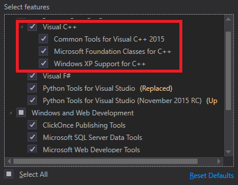

# 入门指南

本主题说明如何获取QGroundControl源代码并在本机或在Vagrant(虚拟机)环境中构建它。 本主题还提供其他可选功能信息及特定于操作系统的功能信息。

## 每日构建

如果您只是想测试 (而不是调试) 最近生成的 *QGroundControl* ，那么请使用[Daily build](https://docs.qgroundcontrol.com/en/releases/daily_builds.html)。 官方提供了适用于所有平台的版本。

## 源代码 

*QGroundControl* 的源代码保存在 github 上，下载地址为: https://github.com/mavlink/qgroundcontrol。 QGroundControl源代码在Apache 2.0和GPLv3下是双许可的。 有关更多信息，请参阅：许可证。

要获取源文件, 请执行以下操作:

1. 克隆存储库 (或您的分叉), 包括子模块: ```git clone https://github.com/mavlink/qgroundcontrol.git --recursive```
2. 2.更新子模块（每次拉新源代码时都这样做）： ```git submodule update```

> 提示：不能使用Github以zip形式下载源文件，因为zip压缩包中不包含相应的子模块源代码。 你必须使用git工具！

## 构建QGroundControl开发环境

### 原生构建

macos、linux、windows、ios 和 android 平台均可支持 *QGroundControl* 的构建。 *QGroundControl* 使用 [Qt](http://www.qt.io) 作为其跨平台支持库, 并将 [QtCreator](http://doc.qt.io/qtcreator/index.html) 用作其默认构建环境。

- macOS：v10.11或更高版本
- Ubuntu：64位，gcc编译器
- **CentOS:** Build instructions can be found on Github here: [CentOS](https://github.com/mavlink/qgroundcontrol/blob/master/CentOS.md)
- **Windows:** Vista or higher, [Visual Studio 2015 compiler](#vs2015) (32 bit)
- **iOS:** 10.0 and higher
- **Android:** Jelly Bean (4.1) and higher. Standard QGC is built against ndk version 19.
- **Qt version:** {{ book.qt_version }} **(only)** <!-- NOTE {{ book.qt_version }} is set in the variables section of gitbook file https://github.com/mavlink/qgc-dev-guide/blob/master/book.json -->

> 提示: 有关更多信息，请参阅：Qt 5支持的平台列表。

#### 安装 visual studio 2015 (仅限 windows) {#vs2015}

Windows环境下的编译器下载链接：[Visual Studio 2015 compiler](https://visualstudio.microsoft.com/vs/older-downloads/) (32 bit)。

安装时, 必须选择的 visual c++ 组件, 如下所示： 

#### 安装Qt

因为 *QGroundControl* 需要访问专用 Qt标头，所以请** 按照下面的方式安装 QT**（而不是使用 linux 发行版中的预构建包）。

安装Qt:

1. 下载并运行[Qt Online Installer](http://www.qt.io/download-open-source) 
    - **Ubuntu:** 
        - 使用以下命令将下载的文件设置为可执行文件：`chmod + x` 
        - 请安装到默认位置, 以便与 **./qgroundcontrol-start.sh** 一起使用。如果将 Qt 安装到非默认位置, 则需要修改 **qgroundcontrol-start.sh** ，才能运行下载的组件。

2. In the installer *Select Components* dialog choose: {{ book.qt_version }}.
    
    然后，按如下向导，安装组件:

- **Windows**: *MSVC 2015 32 bit*
- **MacOS**: *macOS*
- **Linux**: *Desktop gcc 64-bit*
- 必装组件（所有平台） 
    - *Qt Charts* and *Qt Remote Objects (TP)*
    - *Android ARMv7* (为了构建Android) 
        1. 安装附加软件包（特定于平台）
- **Ubuntu:** `sudo apt-get install speech-dispatcher libudev-dev libsdl2-dev`
- **Fedora:** `sudo dnf install speech-dispatcher SDL2-devel SDL2 systemd-devel`
- Arch Linux: pacman -Sy speech-dispatcher
- Windows: USB Driver to connect to Pixhawk/PX4Flow/3DR Radio
- **Android:** [Qt Android Setup](http://doc.qt.io/qt-5/androidgs.html)

#### 使用Qt Creator构建

1. 启动*Qt Creator*并打开**qgroundcontrol.pro**项目。
2. 根据您的需求选择合适的套件： 
    - OSX：桌面Qt {{book.qt_version}} clang 64 bit>注意iOS构建必须使用XCode构建。
    - **Ubuntu:** Desktop Qt {{ book.qt_version }} GCC 64bit
    - **Windows:** 桌面Qt{{ book.qt_version }}MSVC2015**32bit**
    - **Android：** Android平台需选择armeabi的Android-v7a（GCC 4.9，Qt {{ book.qt_version }}）

3. 使用"hammer" (or "play") 图标构建:
    
    

### Vagrant

Vagrant可用于在Linux虚拟机中构建和运行QGroundControl（如果兼容，则构建也可以在主机上运行）

1. 1. 下载并安装Vagrant
2. 2. 从QGroundControl存储库的根目录运行vagrant up
3. 3 .为了使用图形环境，请运行vagrant reload

### 所有支持操作系统的附加构建说明

- **Parallel builds:** For non Windows builds, you can use the `-j#` option to run parellel builds.
- **Location of built files:** Individual build file results can be found in the `build_debug` or `build_release` directories. The built executable can be found in the `debug` or `release` directory.
- **If you get this error when running *QGroundControl***: `/usr/lib/x86_64-linux-gnu/libstdc++.so.6: version 'GLIBCXX_3.4.20' not found.`, you need to either update to the latest *gcc*, or install the latest *libstdc++.6* using: `sudo apt-get install libstdc++6`.
- **Unit tests:** To run the [unit tests](../contribute/unit_tests.md), build in `debug` mode with `UNITTEST_BUILD` definition, and then copy `deploy/qgroundcontrol-start.sh` script into the `debug` directory before running the tests.

## 选项/特定功能

*QGroundControl*的功能依赖于用户安装的操作系统和库。 以下章节描述了这些功能，它们的依赖关系，以及如何在构建过程中禁用/更改它们。 通过为qmake指定其他值，可以强制启用/禁用这些功能。

### Video Streaming

Check the [Video Streaming](https://github.com/mavlink/qgroundcontrol/tree/master/src/VideoStreaming) directory for further instructions.

## 构建 QGC 安装文件

You can additionally create installation file(s) for *QGroundControl* as part of the normal build process.

> **注意** 在Windows上，您需要先安装 [NSIS](https://sourceforge.net/projects/nsis/)。

To add support for installation file creation you need to add `CONFIG+=installer` to your project file, or when you call *qmake*.

To do this in *Qt Creator*:

- 打开 **项目 > 构建 > 构建步骤 > qmake > 额外参数**。
- Enter `CONFIG+=installer` as shown: 