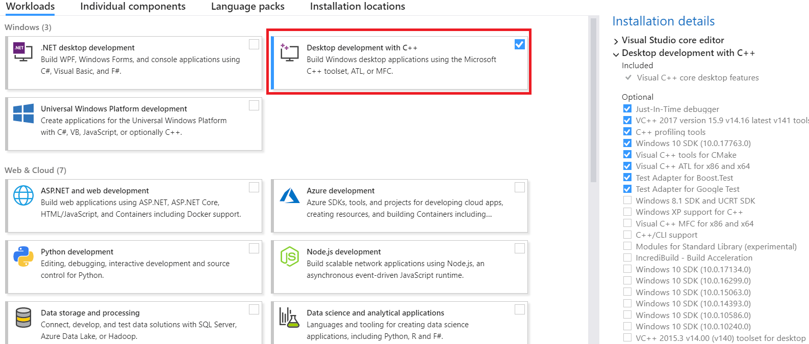

# 入门指南

本主题说明如何获取QGroundControl源代码并在本机或在Vagrant(虚拟机)环境中构建它。 本主题还提供其他可选功能信息及特定于操作系统的功能信息。

## 每日构建

如果您只是想测试 (而不是调试) 最近生成的 *QGroundControl* ，那么请使用[Daily build](https://docs.qgroundcontrol.com/en/releases/daily_builds.html)。 官方提供了适用于所有平台的版本。

## 源代码 

*QGroundControl* 的源代码保存在 github 上，下载地址为: https://github.com/mavlink/qgroundcontrol。 QGroundControl源代码在Apache 2.0和GPLv3下是双许可的。 有关更多信息，请参阅：许可证。

要获取源文件, 请执行以下操作:

1. 克隆存储库 (或您的分叉), 包括子模块: ```git clone https://github.com/mavlink/qgroundcontrol.git --recursive```
2. 2.更新子模块（每次拉新源代码时都这样做）： ```git submodule update```

> 提示：不能使用Github以zip形式下载源文件，因为zip压缩包中不包含相应的子模块源代码。 你必须使用git工具！

## 构建QGroundControl开发环境

### 原生构建

macos、linux、windows、ios 和 android 平台均可支持 *QGroundControl* 的构建。 *QGroundControl* 使用 [Qt](http://www.qt.io) 作为其跨平台支持库, 并将 [QtCreator](http://doc.qt.io/qtcreator/index.html) 用作其默认构建环境。

- macOS：v10.11或更高版本
- Ubuntu：64位，gcc编译器
- **Windows:** Vista or higher, [Visual Studio 2017 compiler](#vs) (64 bit)
- iOS：10.0及更高版本
- Android：Jelly Bean（4.1）及更高版本。 标准QGC是针对ndk 19版本构建的。
- ** Qt版本：</ 0> {{book.qt_version}} **（仅限）</ 0> <!-- NOTE {{ book.qt_version }} is set in the variables section of gitbook file https://github.com/mavlink/qgc-dev-guide/blob/master/book.json --></li> </ul> 
    
    > 提示: 有关更多信息，请参阅：Qt 5支持的平台列表。
    
    

<span></span>

    
    > **Note** 本地[CentOS Builds](../getting_started/CentOS.md)也得到支持，但需单独记录(因为测试环境不同)。
    
    #### 安装 Visual Studio 2017(仅限Windows操作系统) {#vs}
    
    这个Windows编译器可以从这 [Visual Studio 2017 compiler](https://visualstudio.microsoft.com/vs/older-downloads/) (64 bit)找到。
    
    安装过程中，请选择 *Desktop development with C++* ，如下所示：
    
    
    
    #### 安装Qt
    
    You **need to install Qt as described below** instead of using pre-built packages from say, a Linux distribution, because *QGroundControl* needs access to private Qt headers.
    
    如何安装Qt：
    
    1. 下载并运行[Qt Online Installer](http://www.qt.io/download-open-source) 
        - **Ubuntu:** 
            - 使用以下命令将下载的文件设置为可执行文件：`chmod + x` 
            - 请安装到默认位置, 以便与 **./qgroundcontrol-start.sh** 一起使用。如果将 Qt 安装到非默认位置, 则需要修改 **qgroundcontrol-start.sh** ，才能运行下载的组件。
    
    2. 在安装程序 的*Select 组件 </0 > 对话框中, 选择 {{ book.qt_version }}。</p> 
        
        > **Note** If the version needed is not displayed, check the archive (show archive and refresh).
        
        然后，按如下向导，安装组件:</li> </ol> 
        
        - **Windows**: *MSVC 2017 64 bit*
        - **MacOS**: *macOS*
        - **Linux**: *Desktop gcc 64-bit*
        - All:
            
            - *Qt Charts* <!-- and *Qt Remote Objects (TP)* -->
            
            - *Android ARMv7* (to build Android)
                
                1. 安装附加软件包（特定于平台）
        - **Ubuntu:** `sudo apt-get install speech-dispatcher libudev-dev libsdl2-dev`
        - **Fedora:** `sudo dnf install speech-dispatcher SDL2-devel SDL2 systemd-devel`
        - Arch Linux: pacman -Sy speech-dispatcher
        - Windows: USB Driver to connect to Pixhawk/PX4Flow/3DR Radio
        - **Android:** [Qt Android Setup](http://doc.qt.io/qt-5/androidgs.html)
        
        #### 使用Qt Creator构建
        
        1. 启动*Qt Creator*并打开**qgroundcontrol.pro**项目。
        2. 根据您的需求选择合适的套件： 
            - OSX：桌面Qt {{book.qt_version}} clang 64 bit>注意iOS构建必须使用XCode构建。
            - **Ubuntu:** Desktop Qt {{ book.qt_version }} GCC 64bit
            - **Windows:** Desktop Qt {{ book.qt_version }} MSVC2017 **64bit**
            - **Android：** Android平台需选择armeabi的Android-v7a（GCC 4.9，Qt {{ book.qt_version }}）
        
        3. 使用"hammer" (or "play") 图标构建:
            
            
        
        ### Vagrant
        
        [Vagrant](https://www.vagrantup.com/) can be used to build and run *QGroundControl* within a Linux virtual machine (the build can also be run on the host machine if it is compatible).
        
        1. 1. 下载并安装Vagrant
        2. 2. 从QGroundControl存储库的根目录运行vagrant up
        3. 3 .为了使用图形环境，请运行vagrant reload
        
        ### 所有支持操作系统的附加构建说明
        
        - **并行构建：** 对于非Windows系统下的构建，您可以使用`-j＃`选项来运行并行构建。
        - **构建文件的位置：** 可以在`build_debug`或`build_release`目录中找到单个构建文件结果。 可以在`debug`或`release`目录中找到构建的可执行文件。
        - **如果在运行*QGroundControl*时出现报错：** `/usr/lib/x86_64-linux-gnu/libstdc++.so.6: version 'GLIBCXX_3.4.20' not found.` ，则需将*gcc*更新到最新版本，或安装最新版本的*libstdc++.6* ：`sudo apt-get install libstdc ++ 6 ` 。
        - **单元测试：** 如需运行[unit tests](../contribute/unit_tests.md),请使用`UNITTEST_BUILD`定义 `debug`模式，然后在运行测试之前将`deploy / qgroundcontrol-start.sh`脚本文件复制到 `debug`目录中。
        
        ## 选项/与OS相关的特定功能
        
        *QGroundControl* has functionality that is dependent on the operating system and libraries installed by the user. The following sections describe these features, their dependencies, and how to disable/alter them during the build process. These features can be forcibly enabled/disabled by specifying additional values to qmake.
        
        ### 视频流
        
        Check the [Video Streaming](https://github.com/mavlink/qgroundcontrol/tree/master/src/VideoStreaming) directory for further instructions.
        
        ## 构建 QGC 安装文件
        
        You can additionally create installation file(s) for *QGroundControl* as part of the normal build process.
        
        > **Note** 在Windows上，您需要先安装 [NSIS](https://sourceforge.net/projects/nsis/)。
        
        To add support for installation file creation you need to add `CONFIG+=installer` to your project file, or when you call *qmake*.
        
        To do this in *Qt Creator*:
        
        - 打开 **项目 > 构建 > 构建步骤 > qmake > 额外参数**。
        - 输入`CONFIG+=installer`： 