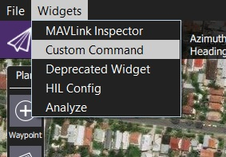
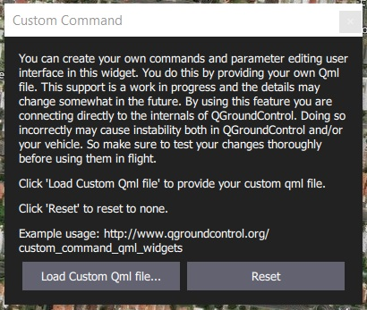
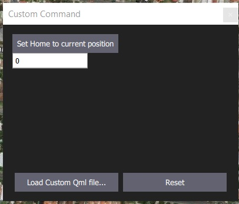
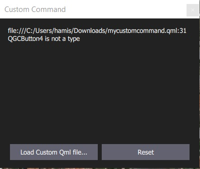

# Custom Command Widgets

The *Custom Command Widget* feature allows developers to load QML UIs at runtime (without having to rebuild *QGroundControl* or understand its internal architecture). A single widget can be loaded at a time and will be "remembered" between *QGroundControl* restarts.

Developers can use any feature of the QML language and any vehicle functionality that is exposed to QML (including a lot of useful "standard vehicle information", but not arbitrary MAVLink traffic or custom types).

The feature is primarily intended for creating simple UIs to send custom commands and change parameters.

> **Warning** This feature is only supported on desktop builds (Windows, Linux, Mac OS). While it is present on end-user builds, it is intended only for developers.

## How to load a Custom Widget

To load a widget:

1. Open the menu **Widget > Custom Command** from any screen.
    
    
    
    The *Custom Command* selection dialog will be displayed.
    
    

2. Select **Load Custom Qml file...** and then find the QML file for the widget load using the file picker (the image below shows the example widget)
    
    

3. Restart *QGroundControl* in order to activate the widget.

4. You can press **Reset** to remove the current widget or **Load Custom Qml file...** to select a new one. If the QML file is invalid, you will get a warning, as shown below.
    
    

## Creating a Widget QML file

Developers can use any feature of the QML language. The sections below show to address the main (intended) use cases:

* Creating a button to send a custom command (MAVLink `COMMAND_LONG` message)
* Defining a parameter editor

> **Note** You must restart QGroundControl to pick up any changes in your QML files even if you press **Reset** (these are cached).

### Sending custom commands

The `QGCButton` control is provided by `QGroundControl.Controls`. It is a wrapper around the standard `QML Button` element, which uses the default QGC font and color palette.

The button connects to the `controller.sendCommand()` method to send a MAVLink `COMMAND_LONG` message (in this case, setting the home position).

```qml
QGCButton {
    text: "Set Home to current position"
    // Arguments to CustomCommandWidgetController::sendCommand (MAVLink COMMAND_LONG)
    //   command id
    //   component id
    //   confirmation
    //   param 1-7
    onClicked: controller.sendCommand(179, 50, 0, 1, 0, 0, 0, 0, 0, 0)
    }
```

### Parameter editors

The `FactTextField` control is provided by the [Fact System](../fact_system.md) (`GroundControl.FactControls`). It is a wrapper around the `QML TextField` element that allows you to bind it directly to any parameter. The parameter is changed automatically when you click **Enter** or click away from the field.

> **Note** * There is currently no value validation. So you may crash your vehicle by setting a parameter to an incorrect value. Validation will come in the future. * Be very careful when referencing parameters. If you specify a parameter that does not exist QGroundControl will warn and shutdown.

```qml
FactTextField {
    // The -1 signals default component id.
    // You can replace it with a specific component id if you like
    fact: controller.getParameterFact(-1, "MAV_SYS_ID")
   }
```

## Example QML file

The example custom command widget QML file below combines the controls documented in the previous section.

```qml
import QtQuick 2.2

import QGroundControl.Controls      1.0
import QGroundControl.FactSystem    1.0
import QGroundControl.FactControls  1.0
import QGroundControl.Palette       1.0
import QGroundControl.ScreenTools   1.0
import QGroundControl.Controllers   1.0

Rectangle {
    anchors.fill:   parent
    color:          qgcPal.window

    CustomCommandWidgetController {
        id:         controller
        factPanel:  panel
    }

    QGCPalette { id: qgcPal; colorGroupEnabled: enabled }

    Column {
        spacing: ScreenTools.defaultFontPixelHeight

        QGCButton {
            text: "Set Home to current position"
            // Arguments to CustomCommandWidgetController::sendCommand (MAVLink COMMAND_LONG)
            //   command id
            //   component id
            //   confirmation
            //   param 1-7
            onClicked: controller.sendCommand(179, 50, 0, 1, 0, 0, 0, 0, 0, 0)
        }

        // The FactTextField control is bound to the specified parameter. Note that there is no validation.
        FactTextField {
            // The -1 signals default component id.
            // You can replace it with a specific component id if you like
            fact: controller.getParameterFact(-1, "MAV_SYS_ID")
        }
    }
}
```